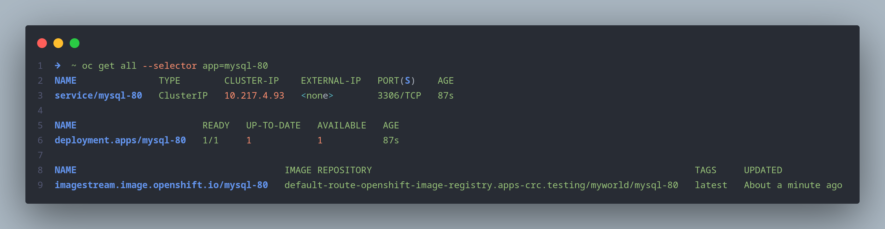
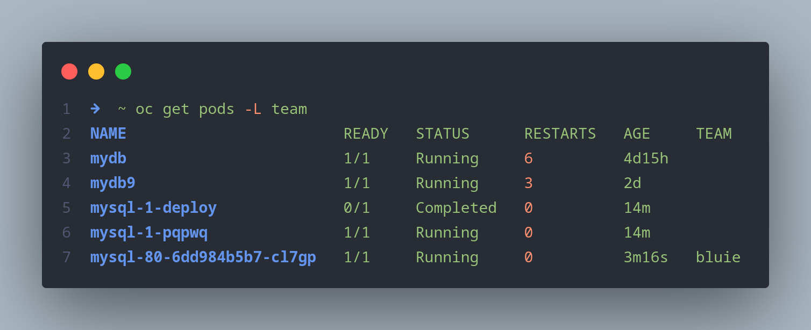
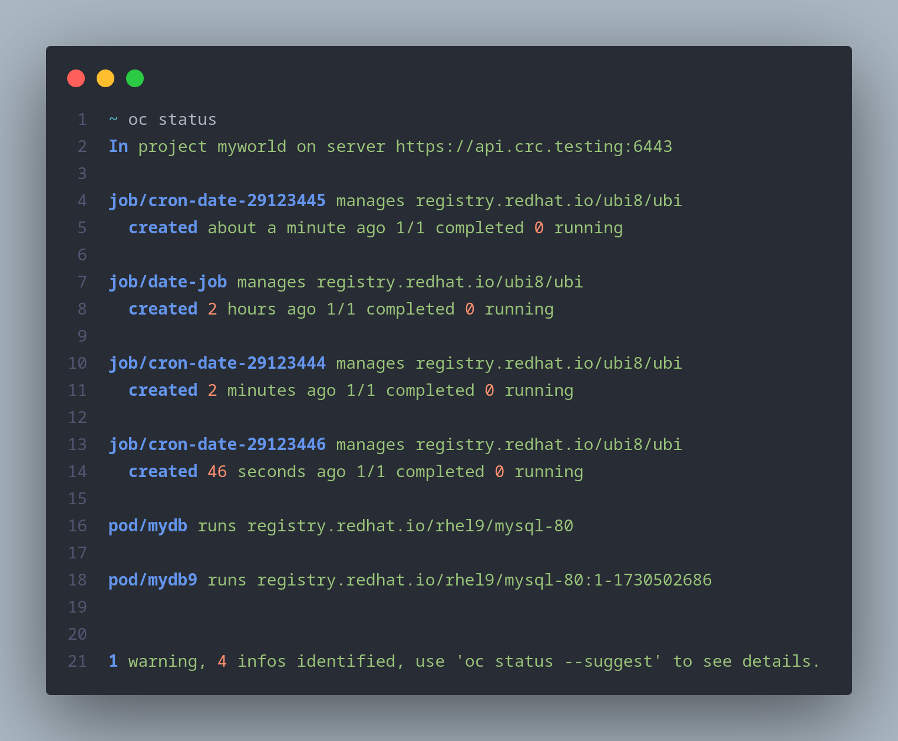

# More notes on command lines

What is included?

- oc new-app
- oc status
- oc get pods -l or -L

## Find all labels for a given pod

```shell
➜  ~ oc get pods mysql-1-bglwz -o json | jq .metadata.labels
{
  "deployment": "mysql-1",
  "deploymentconfig": "mysql",
  "name": "mysql"
}
```


## Deploy the app using image

When you deploy using app, the behavior is different as compared to when you deploy via image

```shell
oc new-app -l team=bluie --image registry.redhat.io/rhel9/mysql-80 \
--env MYSQL_USER=user1 \
--env MYSQL_PASSWORD=user1passi \
--env MYSQL_ROOT_PASSWORD=itemsx
```

## Find resource running using labels

```shell
➜  ~ oc get all --selector app=mysql-80
```



## Add column using -L

```shell
➜  ~ oc get pods -L team
```



## small l is selector, but not all resource get labels esp when not defined in the template

```shell
oc get services -l team=bluie
NAME       TYPE        CLUSTER-IP    EXTERNAL-IP   PORT(S)    AGE
mysql-80   ClusterIP   10.217.4.93   <none>        3306/TCP   88m
```

## Check the status using oc status

```shell
~ oc status
```



### oc deployment

You can update env paramenters of the deployment on the fly.
scenario: You deployed mysql without providing any parameters, in this case pods will fail
and if you look at the oc logs pod/<podName>, you will get message as seen below

```shell
oc logs pods/mydb99-86f48f8666-wgg44 
=> sourcing 20-validate-variables.sh ...
error: You need to specify database name or root password
You must either specify the following environment variables:
  MYSQL_USER (regex: '^[a-zA-Z0-9_]+$')
  MYSQL_PASSWORD (regex: '^[a-zA-Z0-9_~!@#$%^&*()-=<>,.?;:|]+$')
  MYSQL_DATABASE (regex: '^[a-zA-Z0-9_]+$')
Or the following environment variable:
  MYSQL_ROOT_PASSWORD (regex: '^[a-zA-Z0-9_~!@#$%^&*()-=<>,.?;:|]+$')
Or both.
-------------------removed additional text ------------------------
```

```shell
# just the environment variable
oc set env deployment mydb99 \
                         MYSQL_USER=transient \
                         MYSQL_PASSWORD=transientpass \
                         MYSQL_DATABASE=itemsx

# check if you can access this database
oc run -it --rm mydbclient --restart Never \
                         --image registry.redhat.io/rhel9/mysql-80 \
                         -- mysql -h 10.217.1.108 -utransient -ptransientpass -e 'show databases;'
# mysql: [Warning] Using a password on the command line interface can be insecure.
+--------------------+
| Database           |
+--------------------+
| information_schema |
| itemsx             |
| performance_schema |
+--------------------+
pod "mydbclient" deleted

```

## oc create job

```shell
# create simple loop
oc create job date-job --image registry.redhat.io/ubi8/ubi \
-- /bin/bash -c "for i in {1..25}; do date; sleep 2s; done"

# check the logs

oc logs jobs/date-job --follow 

➤ oc get pods -l job-name=date-job
NAME             READY   STATUS      RESTARTS   AGE
date-job-dq264   0/1     Completed   0          3m40s

# delete the job using label as job-name
➤ oc delete pods -l job-name=date-job
pod "date-job-dq264" deleted
➤ 

```
