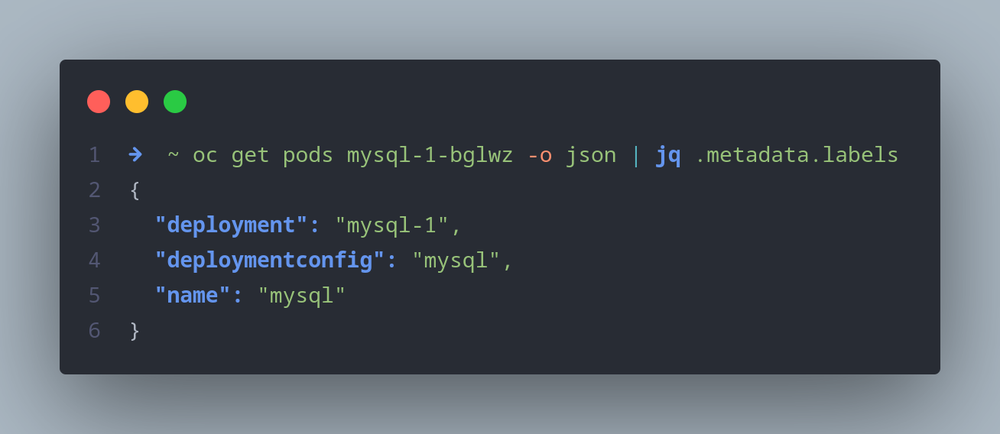

# More notes on command lines

What is included?

- oc new-app
- oc status
- oc get pods -l or -L

## Find all labels for a given pod

```shell
➜  ~ oc get pods mysql-1-bglwz -o json | jq .metadata.labels
{
  "deployment": "mysql-1",
  "deploymentconfig": "mysql",
  "name": "mysql"
}
```



## Deploy the app using image

```shell
oc new-app -l team=bluie --image registry.redhat.io/rhel9/mysql-80 --env MYSQL_USER=user1 --env MYSQL_PASSWORD=user1passi --env MYSQL_ROOT_PASSWORD=itemsx
```

## Find resource running using labels

```shell
➜  ~ oc get all --selector app=mysql-80
NAME               TYPE        CLUSTER-IP    EXTERNAL-IP   PORT(S)    AGE
service/mysql-80   ClusterIP   10.217.4.93   <none>        3306/TCP   87s

NAME                       READY   UP-TO-DATE   AVAILABLE   AGE
deployment.apps/mysql-80   1/1     1            1           87s

NAME                                      IMAGE REPOSITORY                                                           TAGS     UPDATED
imagestream.image.openshift.io/mysql-80   default-route-openshift-image-registry.apps-crc.testing/myworld/mysql-80   latest   About a minute ago
```

## Add column using -L

```shell
➜  ~ oc get pods -L team
NAME                        READY   STATUS      RESTARTS   AGE     TEAM
mydb                        1/1     Running     6          4d15h   
mydb9                       1/1     Running     3          2d      
mysql-1-deploy              0/1     Completed   0          14m     
mysql-1-pqpwq               1/1     Running     0          14m     
mysql-80-6dd984b5b7-cl7gp   1/1     Running     0          3m16s   bluie
```

## small l is selector, but not all resource get labels esp when not defined in the template

```shell
openshift_learning ) oc get services -l team=bluie
NAME       TYPE        CLUSTER-IP    EXTERNAL-IP   PORT(S)    AGE
mysql-80   ClusterIP   10.217.4.93   <none>        3306/TCP   88m
```

## Check the status using oc status

```shell
➜  ~ oc status
In project myworld on server https://api.crc.testing:6443
```
