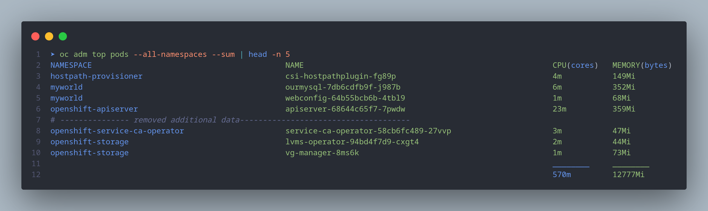

# More notes on command lines

What is included here

- oc adm

## oc adm top pods

```shell

➤ oc adm top pods --all-namespaces --sum | head -n 5
NAMESPACE                                          NAME                                                      CPU(cores)   MEMORY(bytes)
hostpath-provisioner                               csi-hostpathplugin-fg89p                                  4m           149Mi
myworld                                            ourmysql-7db6cdfb9f-j987b                                 6m           352Mi
myworld                                            webconfig-64b55bcb6b-4tbl9                                1m           68Mi
openshift-apiserver                                apiserver-68644c65f7-7pwdw                                23m          359Mi
# --------------- removed additional data-------------------------------------
openshift-service-ca-operator                      service-ca-operator-58cb6fc489-27vvp                      3m           47Mi
openshift-storage                                  lvms-operator-94bd4f7d9-cxgt4                             2m           44Mi
openshift-storage                                  vg-manager-8ms6k                                          1m           73Mi
                                                                                                             ________     ________
                                                                                                             570m         12777Mi
```

Outputs of the commands are always bit difficult to format, hence image is uploaded.



### Utilization of pods and containers within namespace

As I was exploring this, I always wish to know how many containers are running inside the pod
on simple way to find is, to check under column READY, in case of etcd, we have 5 (i.e. 5/5)

```shell
➤ oc get pods -n openshift-etcd
NAME       READY   STATUS    RESTARTS   AGE
etcd-crc   5/5     Running   95         17d
```

I was curious to know the name of these containers. Remember we must always use `[items]`

```shell
➤ oc get pods -n openshift-etcd -o json | jq .items[].status.containerStatuses[].name
"etcd"
"etcd-metrics"
"etcd-readyz"
"etcd-rev"
"etcdctl"
```

No, in case you wish to confirm the same thing, you can use adm command as shown below and ja, the name matches

```shell
➤ oc adm top pods -n openshift-etcd --containers --sum
POD        NAME           CPU(cores)   MEMORY(bytes)
etcd-crc   etcd           59m          290Mi
etcd-crc   etcd-metrics   13m          48Mi
etcd-crc   etcd-readyz    5m           76Mi
etcd-crc   etcd-rev       1m           48Mi
etcd-crc   etcdctl        0m           0Mi
                          ________     ________
                          78m          463Mi
```