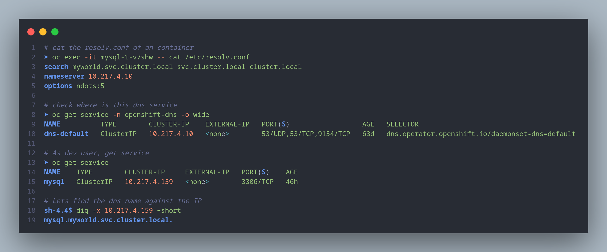

# Command tried today

Small gist to write down what i tried today

oc get templates -n openshift

```shell
➤ oc get templates -n openshift | head
NAME                         DESCRIPTION                                                                        PARAMETERS        OBJECTS
cache-service                Red Hat Data Grid is an in-memory, distributed key/value store.                    8 (1 blank)       4
cakephp-mysql-example        An example CakePHP application with a MySQL database. For more information ab...   21 (4 blank)      8
cakephp-mysql-persistent     An example CakePHP application with a MySQL database. For more information ab...   22 (4 blank)      9
dancer-mysql-example         An example Dancer application with a MySQL database. For more information abo...   18 (5 blank)      8
dancer-mysql-persistent      An example Dancer application with a MySQL database. For more information abo...   19 (5 blank)      9
datagrid-service             Red Hat Data Grid is an in-memory, distributed key/value store.                    7 (1 blank)       4
django-psql-example          An example Django application with a PostgreSQL database. For more informatio...   19 (5 blank)      8
django-psql-persistent       An example Django application with a PostgreSQL database. For more informatio...   20 (5 blank)      9
eap-xp3-basic-s2i            Example of an application based on JBoss EAP XP. For more information about u...   20 (5 blank)      8
```


## Lets find dns information



+